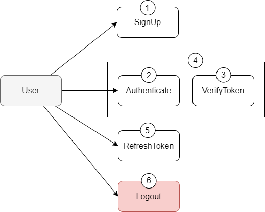

<p align="center">
  
</p>

<div align=center>
<a href="https://test.pypi.org/project/mictlanx/"></a>
</div>
<div align=center>
	<h1>MictlanX: <span style="font-weight:normal;">Elastic storage for ephemeral computing</span></h1>
</div>

<!-- #  MictlanX  -->
**MictlanX** is a prototype storage system developed for my PhD thesis - titled as *Reactive elastic replication strategy for ephemeral computing*.  For now the source code is kept private, and it is for the exclusive use of the *Muyal-ilal* research group. 

## MictlanX - Client 
To perform operation in MictlanX you should to use a special client to reduce the service comunication complexity and increase the performances using the multi-threading features. This repository presents a easy to use client: 

### Getting started 
1)  Installing client by pip
	```sh
	pip install -i https://test.pypi.org/simple/ mictlanx
	```
2) Clone this repository to run the examples. 
	```sh
	git clone git@github.com:nachocodexx/mictlanx-client.git && cd mictlanx-client
	```
3) Set the environment variables located at exmaples/v3/.env
4) Run the example
	```sh
	cd examples/v4 
	python3 ./01_put.py <PATH>
	```  
	A real example of the above command could be the following:
	```sh
	python3 examples/v3/01_put.py /source/01.pdf
	# 2023-09-05 10:25:40 INFO mictlanx-worker_0 PUT 38532d11446c55c07fadc1db2511c9c16146877d491a7472b6203c1ad62fbd0c 60295 0.006456136703491211
	# Ok(<mictlanx.v4.interfaces.responses.PutResponse object at 0x..>)
	```
	After you successfully run this examples you can go to the following url: ```http://<PEER_IP_ADDR>:<PEER_PORT>/api/v4/<KEY>``` 

	:warning: The ```<PEER_IP_ADDR>``` and the ```<PEER_PORT>``` are the peer's unique identification attributes that allows you to connect of one of them to get the ```<KEY>``` that represents in this example the unique identifier of the data.
	
<p align="right">(<a href="#top">back to top</a>)</p>

## Introduction

I'm very glad to introduce the ```v4``` of *MictlanX* which has lots of improvements compare with the old versions:

- Multi-threading client
- Improving put and get operations over chunks.
- Access to your data from whatever peer of your choice.
- Backend improvements decentralized peer-to-peer storage.
- Access and identity control (with synchronization shared state)
  
To summarize the improvements in this version. The use of extra nodes proxy and replica manager was removed, this nodes are indispensable in ```v3``` . Now the storage nodes are not dumb anymore. They communicate each other to balance, distribute, synchronized and manage the global state. 

### Architecture

<!-- <p align="center">
  
</p>
<div align=center>
	<h1>Xolo: <span style="font-weight:normal;">Storage Identity and Access Management</span></h1>
</div> -->

<!-- **Xolo** is an early phase Interpreter-based IAM (Identity and Access Management), the purpose of developing Xolotl was to prevent unwanted user interactions over the objects managed by **MictlanX**.  -->

<!-- ## The key points of Xolo
- Token based authentication (Symmetric key) 
- Symmetric Encryption (AES) 
- X25519 Key Exchange 
- Permissions Declaration Language (PDL)

<p align="right">(<a href="#top">back to top</a>)</p>

## Usage
### :lock: Token based authentication 
This functionality allows developers to avoid implementation of token-based authentication provided by [JWT](https://jwt.io/) 

The following diagram shows you the five operations that a user can perform using **Xolo**.

<p align="center">
  
</p>

- *Sign up* allows a user to register your information like client_id, a secret and metadata.
- *Authenticate* is an operation that verify if a client exists, and if it exists Xolo will check if the secret password is valid for the last generated token then if the token has been verified and it has not been expired then return the client info and the token, but if the token has been expired then generate a new one.
- *Verify token* this operation is useful to valid a token in third-party system that wants to authenticate its users. it is very common to use this operation after the authentication process as shown in the above diagram (4).
- *Refresh token* allows you to generate a new token if and only if the token has not been expired yet, if the token has been expired then you need to authenticate again.
- *Logout* destroy a token to never use it again.  

An example of the operations described above:

First you need to create a instance of Xolo:
```python
from mictlanx.v3.services.xolo import Xolo
xolo = Xolo(
	ip_addr     = os.environ.get("MICTLANX_XOLO_IP_ADDR"),
	port        = int(os.environ.get("MICTLANX_XOLO_PORT",10000)),
	api_version = int(os.environ.get("MICTLANX_API_VERION"))
)
```

**Sign up**: Create a new client with metadata.
```python
from mictlanx.v3.interfaces.payloads import SignUpPayload

payload = SignUpPayload(
	app_id = "Xelhua_fwW0zVpEWo2vK0Sq",
	client_id="jcastillo",
	secret="t0pS3cR3t",
	metadata = {"first_name":"Ignacio", "last_name":"Castillo","age":"26"}
)

xolo.signup(payload)
# Ok(SignUpResponse(.....))
```
**Authenticate**: Check if a user can be authenticated using their client_id and a secret password.
```python
from mictlanx.v3.interfaces.payloads import AuthTokenPayload
from option import Some

payload = AuthTokenPayload(
	app_id = "Xelhua_fwW0zVpEWo2vK0Sq",
	client_id="jcastillo",
	secret="t0pS3cR3t",
	expires_in = Some("1d") # a token valid for one day
)

xolo.auth(payload)
# Ok(AuthResponse(.....))
```

**VerifyToken**: Check if a token is valid.
```python
from mictlanx.v3.interfaces.payloads import AuthTokenPayload,VerifyTokenPayload
from option import Some
# In areal scenario this happens in the past (for demo purpose only)
payload = AuthTokenPayload(
	app_id     = "Xelhua_fwW0zVpEWo2vK0Sq",
	client_id  = "jcastillo",
	secret     = "t0pS3cR3t",
	expires_in = Some("1d") # a token valid for one day
)

#!Never do this in production, first check is the result is ok then unwrap it.(only for demo purposes)
auth_response = xolo.auth(payload).unwrap() 

verify_payload = VerifyTokenPayload(
	app_id    = "Xelhua_fwW0zVpEWo2vK0Sq",
	client_id ="jcastillo",
	secret    = "t0pS3cR3t",
	token     = auth_response.token
)
verify_result = xolo.verify_token(verify_payload)
# Ok(VerifyTokenResponse(.....))
```

**RefreshToken**: Generate a new token  and it invalids the last valid token.
```python
from mictlanx.v3.interfaces.payloads import RefreshTokenPayload

payload = RefreshTokenPayload(
	app_id    = "Xelhua_fwW0zVpEWo2vK0Sq",
	client_id = "jcastillo",
	secret    = "t0pS3cR3t",
	token     = "eyJhbGciOiJIUzI1NiIsInR5cCI6IkpXVCJ9.eyJzdWI......"
)

xolo.refresh_token(payload)
# Ok(RefreshTokenResponse(.....))
```

**Logout**: Destroy the last valid token.
```python
from mictlanx.v3.interfaces.payloads import LogoutPayload

payload = LogoutPayload(
	app_id    = "Xelhua_fwW0zVpEWo2vK0Sq",
	client_id = "jcastillo",
	secret    = "t0pS3cR3t",
	token     = "eyJhbGciOiJIUzI1NiIsInR5cCI6IkpXVCJ9.eyJzdWI......"
)

xolo.logout(payload)
# Ok(LogoutResponse(.....))
```

The ```app_id``` parameters that is used in the five operations is generated by an uncompleted Admin API, but if you want to used the auntentication module of Xolo please contact me :) and ask for you  ```app_id```.   

### Symmetric encryption
Xolo use AES encryption that is the fastest symmetric encription algorithms, making it more practical yo use at scale in real-life apps. In order to encrypt data in Xolo must generate a key.

1) Generate a symmetric key :key:  :

```sh
openssl rand -hex 16 
# c3e02cdc095c31177be947e577695a77
```
the above command generate a 128bits key, if you need a greater security level then consider the generation of a 256bits key using the following command
```sh
openssl rand -hex 32
# 1e490cd52d1e6b051f96edba2af2f7d53e266de9df150c26495f1511511222cc 
```
Onace you have generated your symmetric key with the tool of your choice in hecadecimal format then you can run ```python3 examples/v3/05_xolo_aes.py <SECRET>``` to encrypt a simple hello world message  


### Key exchange (X25519) :closed_lock_with_key:

Xolo provided an elliptic curve Diffie-Hellman key exchange using Curve25519. It allows two parties to jointly agree on a ```shared secret``` using an insecure channel.

- 1) You must generate a key pair using Xolo that are store in ```/mictlanx/keys``` path:
```python
xolo = Xolo()
xolo.key_pair_gen(filename ="alice")
# In another computer
xolo.key_pair_gen(filename ="bob")
```
The above command generate a key pair, for example in the alice's computer in the tree command in ```/mictlanx/keys``` show the following structure: 
```sh
/mictlanx/keys/
├── alice
└── alice.pub
```

:warning: never share your private key.

Once you have generated your key pair then you can run ```python3 exmaples/v3/06_xolo_key_exchange.py``` -->


<!-- CONTRIBUTING -->
## Contributing

Contributions are what make the open source community such an amazing place to learn, inspire, and create. Any contributions you make are **greatly appreciated**.

If you have a suggestion that would make this better, please fork the repo and create a pull request. You can also simply open an issue with the tag "enhancement".
Don't forget to give the project a star! Thanks again!

1. Fork the Project
2. Create your Feature Branch (`git checkout -b feature/AmazingFeature`)
3. Commit your Changes (`git commit -m 'Add some AmazingFeature'`)
4. Push to the Branch (`git push origin feature/AmazingFeature`)
5. Open a Pull Request

<p align="right">(<a href="#top">back to top</a>)</p>


<!-- LICENSE -->
## License

Distributed under the MIT License. See `LICENSE.txt` for more information.

<p align="right">(<a href="#top">back to top</a>)</p>


<!-- CONTACT -->
## Contact

 Ignacio Castillo - [@NachoCastillo]() - jesus.castillo.b@cinvestav.mx

<p align="right">(<a href="#top">back to top</a>)</p>
