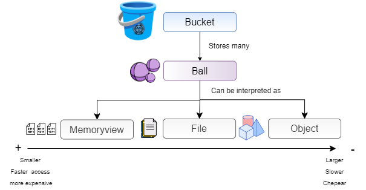
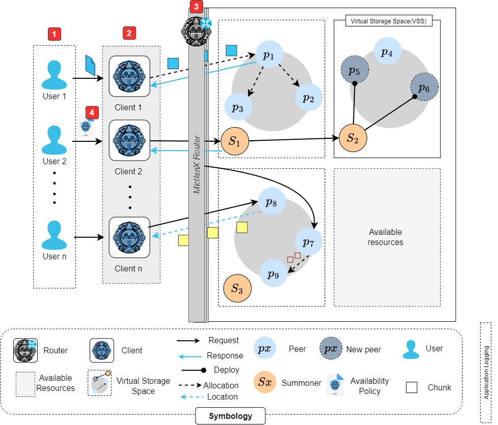
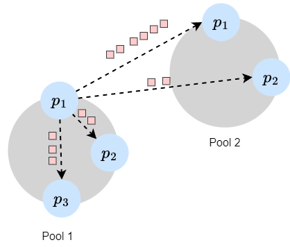

<p align="center">
  
</p>

<div align=center>
<a href="https://test.pypi.org/project/mictlanx/"></a>
</div>
<div align=center>
	<h1>MictlanX: <span style="font-weight:normal;"> Cient for Storage Function as a Service </span></h1>
</div>

<!-- #  MictlanX  -->
**MictlanX** is a prototype storage system developed for my PhD thesis - titled as *Reactive elastic replication strategy for ephemeral computing*.  For now the source code is kept private, and it is for the exclusive use of the *Muyal-ilal* research group. 


## Getting started 🚀

I'm very glad to introduce the ```v4``` of *MictlanX* which has lots of improvements compare with the old versions:

- Multi-threading client
- Improving put and get operations over chunks.
- Access to your data from whatever peer of your choice.
- Backend improvements decentralized peer-to-peer storage.
<!-- - Access and identity control (with synchronization shared state) -->
  
To summarize the improvements in this version. The use of extra nodes proxy and replica manager was removed, this nodes are indispensable in ```v3``` . Now the storage nodes are not dumb anymore. They communicate each other to balance, distribute, synchronized and manage the global state. 


The data granularity in ```MictlanX``` is represented in the Fig. 1  showing how ```MictlanX``` group the data in buckets that store multiple balls. The ball can be interpreted as a memoryview (zero-copy buffer), file that is save on disk or an object that is saved in the Cloud and can be transformed by its methods (e.g encryption, access policies, etc). 
<!-- can be an entire file or chunks that are pieces of data. -->
<div align="center">
  <div>
	
  </div>
  <div>
	<span>Fig 1. Data granularity.</span>
  </div>
</div>

The buckets are an special logic type of storage in ```MictlanX```. The buckets are placed in a virtual storage space (VSS) that enhanced some properties of the data like availability, security and fault-tolerant.


A conceptual representation is shown in the image below, 1) The user or application which produce and consume. The files can be allocated in the system using the 2)  ```MictlanX - Client```, this python-based program makes easy the communication with the system, 3) ```MictlanX Router``` , its role is to balance the load across a set of $VSS$, you can have lots of routers and program your own consistency model, but one ```MictlanX router``` is enough for testing, and, 4) The users can also send availability policies that perform some predefine operation over the peers and update its data replication strategy. 

<p align="center">
  
</p>

In the next section I'm gonna explain in more deep the usage of availabiliy policies.


## Prerequisites 🧾
You must meet the prerequisites to run successfully the MictlanX Client: 

1. Clone this repository to run the examples. 
	```sh
	git clone git@github.com:nachocodexx/mictlanx-client.git && cd mictlanx-client
	```
2.  Installing dependencies using the following command:
	```sh
	pip3 install -r ./requirements.txt
	```
3. You should create a folder to save the client's log, the default path is at ```/mictlanx/client```: 
   
	```bash
	export CLIENT_LOG_PATH=/mictlanx/client

	sudo mkdir -p $CLIENT_LOG_PATH && sudo chmod 774 -R $CLIENT_LOG_PATH && sudo chown $USER:$USER $CLIENT_LOG_PATH
	```
	:warning: Make sure to assign the right permissions.

## Migration guide
This system is still in an alpha stage so integrating changes that will probably make previous versions obsolete will be common, for this new change from the peer version (4) to the router version (4.1), the following change in the client object is required:

```python
    
    routers = Utils.routers_from_str(
        routers_str = "mictlanx-router-0:localhost:60666",
        protocol    = "https"
    )

    client = Client(
        client_id    = "client-0",
        # (now) This is the most important change   V.4.1
        routers         = list(routers),
        # (before ) V.4
        # peers = list(peers)
        
        # 
        debug           = True,
        #   
        max_workers     = 2,
        #
        bucket_id       = bucket_id,
        # Now the log path is user defined. 
        log_output_path = "/home/jcastillo/log"
    )
```

Regarding the url to be used to connect to a router inside the cluster you can use the following one  ```alpha.tamps.cinvestav.mx/v0/mictlanx/router``` remember to activate the ```https```, an example of a list of routers using the test cluster can be as follows:

```python
    routers = Utils.routers_from_str(
        routers_str = "mictlanx-router-0:alpha.tamps.cinvestav.mx/v0/mictlanx/router:-1",
        protocol    = "https"
    )
```


## First steps ⚙️
Run the examples in this repository located at the folder path```examples/```. First you should configure the client using the ```.env``` file. 
```shell
MICTLANX_ROUTERS="mictlanx-router-0:localhost:60666"
MICTLANX_PROTOCOL="http"
MICTLANX_MAX_WORKERS=4
MICTLANX_API_VERSION=4
```
⚠️If you want to configure at fine-grain level you should use the python interface. See [Advance usage](#)

If you don't have a virtual spaces up an running, you can use the following test virtual space with maxium payload of 100MB that means that you cannot upload files greater than 100MB, replace the ```MICTLANX_ROUTERS``` and ```MICTLANX_PROTOCOL```:

```sh
MICTLANX_ROUTERS="mictlanx-router-0:https://alpha.tamps.cinvestav.mx/v0/mictlanx/router/:-1"
MICTLANX_PROTOCOL="https"
```


Next, you can perform basic ```PUT``` and ```GET``` operations, first we are going to perform a ```PUT``` using the following command:

```sh
export BUCKET_ID=mictlanx
export SOURCE_FILE_PATH=/source/01.pdf

python ./examples/v4/01_put.py $BUCKET_ID $SOURCE_FILE_PATH
```

⚠️ Make sure that you assign a path of an existing file.

The result in the terminal looks like this:
```json
{
    "timestamp": "2024-02-29 00:38:55,986",
    "level": "INFO",
    "logger_name": "client-0",
    "thread_name": "mictlanx-worker_0",
    "event": "PUT.CHUNKED",
    "bucket_id": "mictlanx",
    "key": "0c32710342f5dd28bc36956aadc0b52398fad8222e6edec18b34d3d72f06e7bd",
    "size": 25243,
    "response_time": 0.15774822235107422,
    "peer_id": "mictlanx-peer-0"
}
```
Copy the key of the file to download later

✨ The logs are stored in  ```MICTLANX_CLIENT_LOG_PATH``` if you don't set a value for the ```MICTLANX_CLIENT_LOG_PATH``` the default value is ```/mictlanx/client```.

Next you can access your data, but first, we can get the metadata of the file:

```sh
export KEY=0c32710342f5dd28bc36956aadc0b52398fad8222e6edec18b34d3d72f06e7bd
export MICTLANX_PROTOCOL=http
export PEER_URL=localhost:7000

curl -X GET $MICTLANX_PROTOCOL://$PEER_URL/api/v4/buckets/$BUCKET_ID/metadata/$KEY
```

✨ You also can copy the url in a browser to see the metadata. ⚠️Remeber change the variables for the actual value for example click to see the metadata [click here](https://alpha.tamps.cinvestav.mx/v0/mictlanx/router/api/v4/buckets/mictlanx/metadata/0c32710342f5dd28bc36956aadc0b52398fad8222e6edec18b34d3d72f06e7bd).

Run the following command toget data using your ```KEY``` and your ```BUCKET_ID```:

```sh
export BUCKET_ID=mictlanx
export KEY=bac9b6c65bb832e7a23f936f8b1fdd00051913fc0c483cf6a6f63f89e6588b80
export NUM_GETS=10
python3 ./examples/v4/02_get.py $BUCKET_ID $KEY $NUM_GETS
```

You're gonna see in the terminal something like this:

```json
{ 
	"timestamp": "2024-02-11 08:53:42,961",
	"level": "INFO",
    "logger_name": "client-example-0",
    "thread_name": "mictlanx-worker_0",
    "event": "GET",
    "bucket_id": "mictlanx",
    "key": "bac9b6c65bb832e7a23f936f8b1fdd00051913fc0c483cf6a6f63f89e6588b80",
	"size": 110857,
    "response_time": 1.1288352012634277,
    "metadata_service_time": 0.4961841106414795,
    "peer_id": "mictlanx-peer-1"
}
```


<p align="right">(<a href="#top">back to top</a>)</p>

## Advance usage 🦕

If you want to create a more fine-tune client that performs ```PUT``` and ```GET``` operations in your systems, you only require a few lines of code:

First you need to add the following imports at the top of your ```.py``` file:
```python
import os
import sys
from mictlanx.v4.client import Client
from mictlanx.utils.index import Utils
```
First you need to define the ```bucket_id``` variable
```python
bucket_id = "mictlanx"
```
Then you need to create the list of peers using the ```Utils``` module or you can create the ```List[Peer]```:
```python
peers =  Utils.peers_from_str_v2(
	peers_str= "mictlanx-peer-0:alpha.tamps.cinvestav.mx/v0/mictlanx/peer0:-1", 
	protocol= "https"
) 

'''
or you can declare the peers usign the Peer object.

from mictlanx.v4.interfaces.index import Peer
peers = [
	Peer(peer_id="mictlanx-peer-0",ip_addr="alpha.tamps.cinvestav.mx/v0/mictlanx/peer0",port=-1,protocol="https")
]
'''
```
Now you can create an instance of the ```Client``` class:

```python
client = Client(
	client_id    = "github-repo-client-0",
	peers        = list(peers),
	debug        = False,
	daemon       = True, 
	max_workers  = 2,
	lb_algorithm = "2CHOICES_UF",
	bucket_id    = bucket_id 
)
```

```python
result = client.put_file_chunked(
    path       = "/source/01.pdf",
    chunk_size = "1MB",
    bucket_id  = bucket_id,
    tags       = {"test":"Add whatever you want in the tags diccionary"},
    
)
```

### Client parameters
|Parameter|Description|Type |Default value|
|----------------|-------------------------------|-----------------------------|-----------------------------|
|client_id |The unique identifier of a client.| ```str``` |No defined. (REQUIRED)|
|bucket_id|The unique identifier of a bucket.|```str```|No defined|
|peers|The list of available peers for the client.| ```List[Peer]```|empty list|
|debug|Enable the debug mode if true (you can see all the logs DEBUG level).|```bool```|True|
|show_metrics|Enable the logging of client's metrics.|```bool```|True|
|daemon|Enable the background metrics this improve the load balancing|```bool```| True|
|max_workers|Set the max numbers of worker threads |```int```| 4|
|lb_algorithm|Set the load balancing algorithm| ```ROUND_ROBIN``` \| ```HASH``` \| ```PSEUDORANDOM``` \| ```2CHOICES```  \| ```SORT_UF``` \| ```2CHOICES_UF``` | ```ROUND_ROBIN``` |
|output_path|Set the local path to save the log files|```str```| /mictlanx/client|
|heartbeat_interval|Set the timespan of the analysis thread|```timestamp-str``` [see more](https://humanfriendly.readthedocs.io/en/latest/api.html#humanfriendly.parse_timespan)| ```15s```|
|metrics_buffer_size|The buffer of events used to local analysis|```int```|100|
|check_peers_availability_interval|Set the timestamp to check the availability of peers |```timespan-str``` | ```15m```|
|disable_log|If true this parameter disable all the logs|```bool```| False|
|log_interval|Set the time withou unit to write log in disk|```int```|30|
|log_when|Set the unit of time to write log in disk|```str```|m|

<p align="right">(<a href="#top">back to top</a>)</p>

## Async Client (coming soon)
If you want to perform thousands or millions of operations without saturating the client, it is essential to use the asynchronous version, which will allow you to queue thousands of operations and will transparently provide you with successful task completion through retry strategies.

You receive a response as soon as the task is registered in the queue.  

```python
from mictlanx.async.client import AsyncClient
from mictlanx.v4.interfaces.index import Peer

client=  AsyncClient(
	client_id="client-0",
	peers= [
		Peer(peer_id="mictlanx-peer-0", ip_addr="localhost", port=7000,protocol="http"),
		Peer(peer_id="mictlanx-peer-1", ip_addr="localhost", port=7001,protocol="http"),
	],
	debug= False,
	show_metrics=False,
	daemon=True,
	max_workers=10,
	lb_algorithm="2CHOICES_UF",
)
client.start() # Don't forget this line!!!
```

You will be able to perform a ```PUT``` operation as normally did before, the big differece is that you get a ```task_id``` and you can query the state of your task:

```python
client.put(bucket_id="mictlanx", key="", path="/source/01.pdf",chunk_size="1MB")
## Ok("572a9dcd42bd47e1a2869e86ad8c2efe")
```


### Availability policies ❗(coming soon)
TheThe availability policies allow defining the replication strategy steps. Replication strategies is the definition of a series of steps with the objective of increasing data availability. This time I present an interpreter written in Python, although there is also a version in Rust. For now I will explain the interpreter found in this repository, which you can easily use as follows:  

``` python
 from mictlanx.v4.tlaloc.tlaloc import Tlaloc

 tlaloc = Tlaloc(protocol="http",ip_addr="localhost",port=15000)
    ap_str = """
        tlaloc: v1
        available-resources:
            pool-1:
                - peer-1
                - peer-2
                - peer-3
            pool-2:
                - peer-1
                - peer-2
                - peer-3
        who: pool-1.peer-1
        what:
            - cubeta.red_file
        where:
            - pool-1.peer-1
            - pool-1.peer-2
            - pool-1.peer-3
            - pool-2.peer-1
            - pool-2.peer-2
            - pool-2.peer-3
        how: ACTIVE
        when:
            -cubeta.red_file:$ACCESS_FREQUENNCY>=60.6%
    """
```

The replication schema represented in the next figure, in plain english you imagine the replication strategy as the response to contextual question:

- **Who starts the replication?** Peer ``peer-1`` in the pool ```pool-1```.
- **What data should be replicated?** ```red_file``` which belongs to bucket ```cubeta```
- **Where should the replicas be placed?** in the ```peer-2``` and ```peer-3``` belonging to pool 1 and all peers in pool 2.
- **How should the replication be performed?** Replication must be performed actively. This means that all replications must be written before consumption. 
- **When should replication be initiated?** when access frecuency of the ```red_file``` increases greater or equal than 60.6%

<p align="center">
  
</p>
## Acess & Identity management using Xolo (coming soon ❗)
First you need to generate a key/pair by default they are generated at ```/mictlanx/xolo/.keys```, you can change it using th environment variable ```XOLO_SECRET_PATH```:

```python
from mictlanx.v4.xolo.utils import Utils as XoloUtils

XoloUtils.X25519_key_pair_generator(filename="foo") 
```
<!-- CONTRIBUTING -->
## Contributing

Contributions are what make the open source community such an amazing place to learn, inspire, and create. Any contributions you make are **greatly appreciated**.

If you have a suggestion that would make this better, please fork the repo and create a pull request. You can also simply open an issue with the tag "enhancement".
Don't forget to give the project a star! Thanks again!

1. Fork the Project
2. Create your Feature Branch (`git checkout -b feature/AmazingFeature`)
3. Commit your Changes (`git commit -m 'Add some AmazingFeature'`)
4. Push to the Branch (`git push origin feature/AmazingFeature`)
5. Open a Pull Request

<p align="right">(<a href="#top">back to top</a>)</p>


<!-- LICENSE -->
## License

Distributed under the MIT License. See `LICENSE.txt` for more information.

<p align="right">(<a href="#top">back to top</a>)</p>


<!-- CONTACT -->
## Contact

 Ignacio Castillo - [@NachoCastillo]() - jesus.castillo.b@cinvestav.mx

<p align="right">(<a href="#top">back to top</a>)</p>
