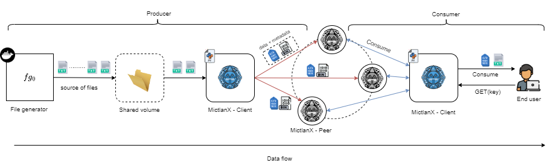

# USE CASE 1 - Upload multiple files to MictlanX
The task is simple, transfer a batch of files to MictlanX and then consume them everywhere using the ```MictlanX - Client``` or by using the API.

In you dont have file, you can generate using the ```nachcocode/utils:file-generator``` docker image. Setting up the file generator to produce $n$ random generate files with a 10MB avg file size and stdev of 2MB. 

For the purpose of this example we perform a request to MictlanX at mean arrival rate ($\lambda$) . So we generate a exponentially distributed interarrival time with a mean of $\frac{1}{\lambda}$. The next diagram shows a conceptual representation of the whole process from producer to consumer side:  

<div align=center>
<a href="https://test.pypi.org/project/mictlanx/"></a>
</div>

## Getting started
To execute this example in your local machine, you need to generate the files, please use the following command: 
```sh
docker run \
        --name fg-0 \
        -e AVG_FILE_SIZE="10MB" \
        -e STD_FILE_SIZE="2MB" \
        -e N=100 \
        -e OUTPUT_FOLDER="/out" \
        -e FILENAME_PREFIX="" \
        -e FILENAME_SEPARATOR="" \
        -e MAX_THREADS="2" \
        -v /test/out_docker:/out \
        -d nachocode/utils:file-generator
```
Please feel free to change the parameters as you like. This command generate a folder ```$OUTPUT_PATH``` that contains all the generated files. It also generate a metadata CSV that containts basic information about the generated file, so every record in the CSV file is the metadata of a file. This CSV file is located at ```$OUTPUT_PATH/trace.csv```

Now you are ready to execute the script to upload your generated files, first located the ```main.py``` and execute using ```python3```:
```sh
python3 ./examples/v4/use-cases/01_upload_in_bulk/src/main.py
```
:warning: Remember to update the ```.env``` file depending on your needs.

```
# By default this points to the trace generated by file-generator if you decide to upload a different batch please set to blank. 

TRACE_PATH="/test/out/trace.csv"

# By default it points to the output_foler of the file-generator. Please be free to change to another batch of files and set TRACE_PATH to empty string

SOURCE_FOLDER="/test/out"

# Reach me out to get the peer information :) jesus.castillo.b@cinvestav.mx

MICTLANX_PEERS="mictlanx-peer-0:localhost:7000"

# Unique identifier of the client
MICTLANX_CLIENT_ID="client-0"

# Unique identifier of the bucket.
MICTLANX_BUCKET_ID="default"

# Number of concurrent threads that perform put and get operation asynchronously
MICTLANX_MAX_WORKERS="2"
```

